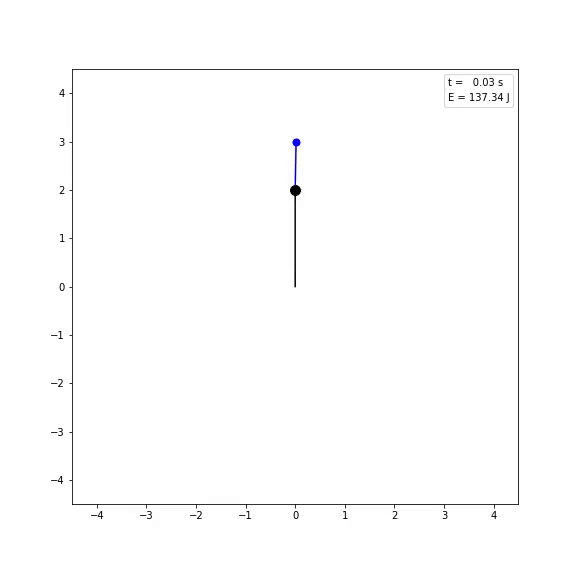

# Simulations
---
## Double Pendulum
Simulation of a simple double pendulum that takes in initial conditions for the lengths and masses of each pendulum, as well as the initial angles. The angular accelerations are then calculated using the Euler-Lagrange equations, and then the equations of motion are solved for using scipy.odeint().

